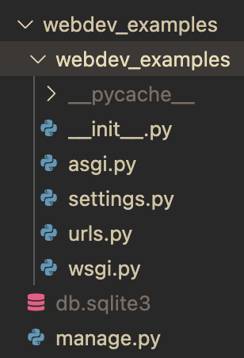
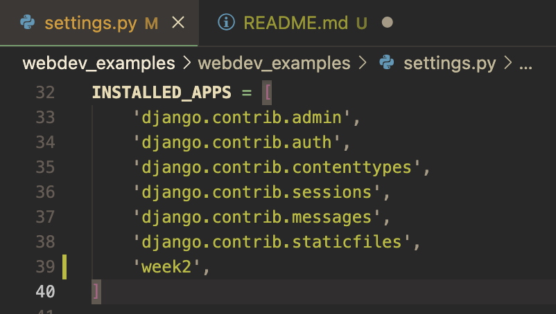
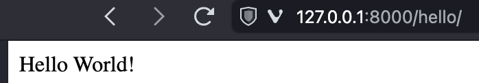

# Week 2 - Function Based Views 

## Why Django

**Fast/Batteries Included**

Django has a lot of functionality built in for you and has made many design considerations/tradeoffs that are good. 

Because functionality is built in, it "just works" and avoids a lot of decision making about things you probably aren't yet qualified to make decisions on.

**Secure**
Web site security is very important and django is set up to provide a lot of security by default to ensure your site and data is protected.


**Scalable**
Instagram, Spotify, YouTube, and Pinterest are all built on Django. A properly constructed Django server can scale to millions of users.

## How Django Works

Last week we created a new project with `python -m django startproject webdev_examples`, let's take a deeper look at what was created



**manage.py** Possibly the most important, and one of the most heavily used files, manage.py lets you manage your django project including running the server and performing database operations.

**webdev_examples** A folder with the same name as the project is created that has all the project level files. A project will contain one or more APPLICATIONS

**__pycache__** A folder holding python cache files, ignore this, python uses it to speed itself up by storing some information that can be reused instead of recalculating it (this is called caching in computer terminology)

**\_\_init\_\_.py** Ignore for now. Generally empty.

**asgi.py/wsgi.py** Asynchronous Server Gateway Interface/Web Server Gateway Interface - Called as part of running a django application as a web server.

**settings.py** All the settings for the django application to configure the basic behaviors of the server. This file is very important and will be used a lot.

**urls.py** All the URLS of the database 

**db.sqlite3** The default database for the application. A database lets us permanently store information for our website, for instance, items in a to do list or a list of baseball players.

## Our First Django Web Page

### Exercise 0 - Make your application accessible to others on the network

1. Open settings.py 
1. Change the line that says `ALLOWED_HOSTS = []` to `ALLOWED_HOSTS = ["*"]
1. Open a command line in your django project folder (e.g. `webdev_examples`). In VS Code you can do this by pressing `` Ctrl+Shift+` ``. Start your django webserver by typing `python manage.py runserver 0.0.0.0:8000`
    - 0.0.0.0 means "make the webserver available to all IP addresses", 127,0.0.1 is the default (i.e. if you don't specify anything after `runserver`) and means only your local computer can connect to the web server
1. Find your IP address (on mac: `ifconfig`, on linux: `ip addr show`, in windows `ipconfig`)
1. Have someone sitting next to you put your ip address into their browser and specify port 8000, e.g. `192.168.1.177:8000`

### Exercise 1 - Start a new app in the project

1. Open a command line in your django project folder (e.g. `webdev_examples`) (in VS Code you can do this by pressing `Ctrl+Shift+\``)
1. Create a new application by typing `python manage.py startapp hello`
    - We just created an application inside of a project. A django project has one or more applications. The intention of an application is that it is portable - you could reuse it in other django projects

1. The app has been created, but the project still doesn't "know" about it. We need to tell the project that there is an application it should use. To do this we are going to edit the `INSTALLED_APPLICATIONS`
    - append `hello,` to the `INSTALLED_APPLICATIONS` array in settings.py
[](installed-applications.png)

This created a new folder called "hello" inside of the webdev_examples folder. There are several new files/folders here: 

**migrations** This folder holds files related to datbase management. We'll get into this in future weeks. At the moment it is empty (except for \_\_init__.py which is also empty)

**admin.py** Used for managing the admin section of your application. The admin is a nice feature of django that generates an automatic webpage for working with your database.

**apps.py** Contains information about your class that is used by the admin part of your app, it can also be used elsewhere. In general we probably won't edit this file.

**models.py** This is used to define the structure of all the information that will be stored in your database. We will edit this file a lot.

**tests.py** Excellent programmers write tests for their django application. A test is a piece of code that you can run that will give a pass fail result to show your django app is working the way it should. Unfortunately, it is beyond the scope of this introductory class.

**views.py** This is likely going to be the most edited file in the application. This is the part of the app responsible for returning specific responses to specific http requests.

### Exercise 2 - Say Hello

In the previous exercise we created an app, but we haven't made it do anything yet. Let's make it simply display the word "hello" when we go to our web address. To do this we need to define a view. **A view is a Python function that takes a Web request and returns a Web response**. A web response is either a whole or even part of a web page (html), but it technically can be anything we need it to be.

1. First open webdev_examples/hello/views.py and enter the following code:
    ```python
    from django.shortcuts import render
    from django.http.response import HttpResponse 

    def sayHello(request):
        return HttpResponse("Hello World!")
    ```
    You will notice that `render` was already there and imported by default. We will eventually get to using `render` instead of `HttpResponse` in a later lesson.

    First we import HttpResponse which is a *function* provided by django that allows our webserver to respond to an http (Hyper Text Transfer Protocol) request. Remember all traffic on the internet is http, the language of web pages is html, but the language for asking for a webpage is http.

    All this code does is send the response "Hello" whenever this function is called. At this point we're not even sending a web page, just the text "Hello World!"

2. Next we need to tell the webserver to call this function we just defined. Open webedev_examples/urls.py, and append `from hello import views as helloviews` after the other imports (the order of the imports does not matter, e.g. you could import it first). This makes the functions in views.py in the hello folder able to be called as `helloviews.<function name>`

1. In urls.py you should see the default path for the admin interface `path('admin/', admin.site.urls),`, on the next line append `path('hello', hello_views.sayHello),`. This tells django that when we go to the page `http://<your ip address or url>:8000/hello` to call the sayHello function to get an http response to send back to the web browser. It should now look as follows:
    ```python
    from django.contrib import admin
    from django.urls import path
    from hello import views as hello_views

    urlpatterns = [
        path('admin/', admin.site.urls),
        path('hello', hello_views.sayHello),
    ]
    ```
    
1. Go to 127.0.0.1:8000/hello in your web browser and you should now see the below:
    [](installed-applications.png)

## Resources

[Django Views - The Right Way](https://spookylukey.github.io/django-views-the-right-way/the-pattern.html)

[Django Docs](https://docs.djangoproject.com/en/5.1/)
